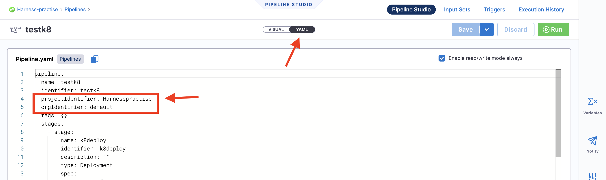
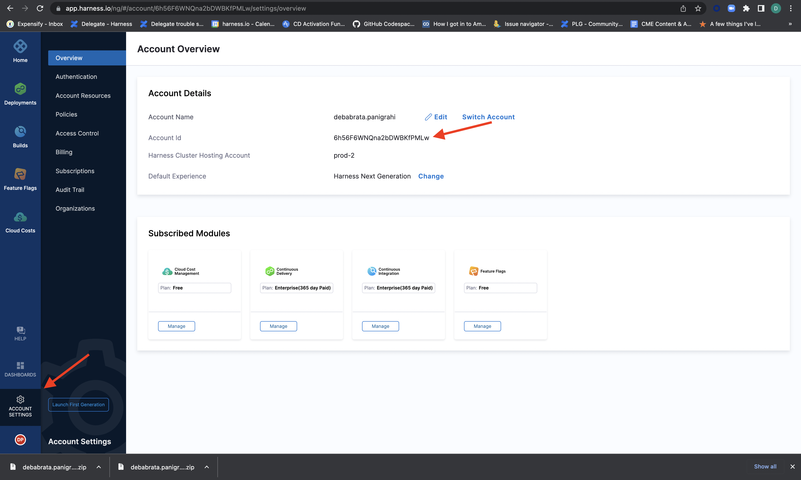

# Deploy Docker Delegate and Setup Local K8s Infrastructure In Under 5 Minutes
## Prerquisites

---
- Tools Used
    - [**k3d**](https://k3d.io/v5.4.6/) - K3d is wrapper to k3s on docker,we used k3d to create a single node Kubernetes cluster locally 
    - [**docker**](https://docs.docker.com/install/) to be able to use k3d
    - [**kubectl**](https://k3d.io/v5.4.6/) to interact with the Kubernetes cluster
 * You need to create a Harness API Key, using the Harness SaaS platform, the detailed steps for the same are mentioned [here](https://docs.harness.io/article/bn72tvbj6r-harness-rest-api-reference#step_1_create_a_harness_api_key_and_pat), further details on managing the API keys and the PAT can be found in our [documentation](https://docs.harness.io/article/tdoad7xrh9-add-and-manage-api-keys#harness_api_key).
 * Next, start with [creating an organisation](https://docs.harness.io/article/36fw2u92i4-create-an-organization#step_1_create_a_harness_org), followed by [creating a project](https://docs.harness.io/article/36fw2u92i4-create-an-organization#step_3_create_a_project) and then start with creating a pipeline under any module of your choice, and move to the YAML view to find the "ORGIDENTIFIER" and "PROJECTIDENTIFIER". 

 * For "ACCOUNTIDENTIFIER", is same as the Account ID, which could be found in the URL or under the account settings.

:tada: Now get started with the script to get your delegate installed. 

## Steps to get the script running

---
*   Export the below variables  in your environment 
    
    - For Windows users:
        
        ```bash
        set APIKEY=‘XXXXXX’
        set ACCOUNTIDENTIFIER=‘XXXXXX’
        set ORGIDENTIFIER=‘default’
        set PROJECTIDENTIFIER=‘TestProject’
        set TOKENIDENTIFIER=‘mytoken1’
        set KUBAENETESDELEGATENAME=‘k8delgate’
        set DOCKERDELEGATENAME=‘dockerdelegate’
        ```
    - For Linux and MacOS users:
    
        ```bash
        export APIKEY='XXXXXX'
        export ACCOUNTIDENTIFIER='XXXXXX'
        export ORGIDENTIFIER='default'
        export PROJECTIDENTIFIER='TestProject'
        export TOKENIDENTIFIER='mytoken1'
        export KUBAENETESDELEGATENAME='k8delgate'
        export DOCKERDELEGATENAME='dockerdelegate'
        ```

* Finally run the below  command

```bash
curl -s -H "Accept:application/vnd.github.v3.raw" https://raw.githubusercontent.com/k3d-io/k3d/main/install.sh>installk3d.sh && curl -s -H "Accept:application/vnd.github.v3.raw" https://raw.githubusercontent.com/ronakforgit/delegate-quickstart-api/delegate-script/automatedelegate.sh | bash
```